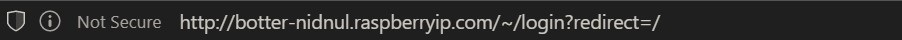

↰ [Return to Index](index.md)

# Simple HTTPS on a custom domain, the Urbit way

### Caveats

Urbit needs to have its http service bound to port 80 (It will annouce what port it binds to in the terminal on start up). On linux, you can allow Urbit to bind to this port with the `setcap` command (e.g. `sudo setcap 'cap_net_bind_service=+ep' ~/urbit-v0.10.8-linux64/urbit`).

If on a LAN you may need to forward port 80 to and from your router and device running Urbit. Many home internet service providers block port 80 for their customers, so this may not work at all.

### DNS Provider

I use [freedns.afraid.org](https://freedns.afraid.org/) because they provide real Type A DNS Records, and they have a domain I like (you'll see). Not all free DNS services will use this method, some do forwarding with nginx or other shenanigans. We want Let's Encrypt to work, so we want something simple and direct like an A Record.

([Duck DNS](https://www.duckdns.org/) is also known to work and lets you login with multiple different OAuth providers.)

After you create an account, [create a subdomain](http://freedns.afraid.org/subdomain/)

If you don't like the short list of recommended domains, click **Many many more available** to [see a larger list](http://freedns.afraid.org/domain/registry/)

Choose a domain, and complete setup. If you're uncertain about your external IP address, you can run `+http://ifconfig.io/ip` in your Urbit's dojo to find out.

Now let's navigate to the sumbdomain that was just setup, to make sure it worked.

It works, but we need to get https working. Let's run some commands in dojo.

First, make sure Urbit's acme app is running with `|start %acme`

Next run `:acme &path /topleveldomain/domain/subdomain`

And it completed successfully!

↰ [Return to Index](index.md)
